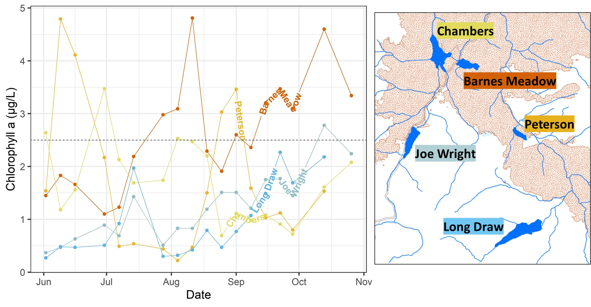
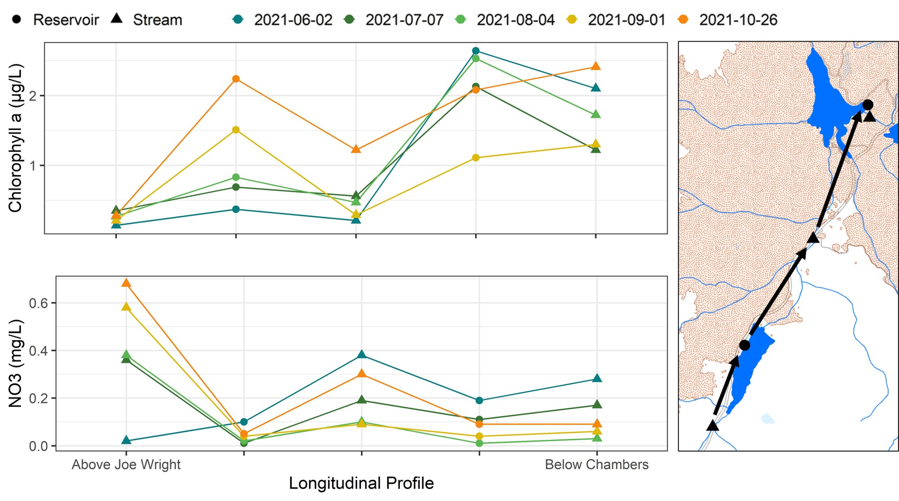

# Initial Findings

```{r, echo = F, include= F, eval=T, warning=F, message=F}
library(tidyverse)
library(sf)
library(mapview)
library(leafpop)
library(geomtextpath)
library(ggpubr)

daily_discharge <- read_csv('data/FCW_Rustic_Streamflow.csv') %>%
  mutate(Date=as.Date(Date,format="%m/%d/%Y")) %>%
  group_by(Date) %>%
  summarize(mean_cfs=mean(CFS))

buffer_sbs <- read_csv('data/raw/sbs_buffer.csv') %>%
  mutate(Buffer_Level=((Unburned*0)+(V_Low*0.1)+(Low*0.4)+(Moderate*0.7)+(High*1))/(Unburned+V_Low+Low+Moderate+High))

watershed_sbs <- read_csv('data/raw/sbs_watershed.csv') %>%
  mutate(Watershed_Level=((Unburned*0)+(V_Low*0.1)+(Low*0.4)+(Moderate*0.7)+(High*1))/(Unburned+V_Low+Low+Moderate+High)) %>% rename(Site_Code=SITE_CODE)

chla_table <- read_csv('data/Chla_Reservoir_Data.csv') %>%
  left_join(read_csv('data/xy.csv'), by="Site_Code") %>%
  filter(!is.na(Location)) %>%
  mutate(Watershed=ifelse(Site_Code %in% c('LNGR','LNGO'),"Long Draw",
                          ifelse(Site_Code %in% c('PTRO','PTRR'),'Peterson',
                                 ifelse(Site_Code %in% c('JOEI','JOER','CBRI'),"Joe Wright",
                                        ifelse(Site_Code %in% c('CBRR','CHD'), "Chambers",
                                               ifelse(Site_Code %in% c('BRNR','BMD'),"Barnes Meadow",
                                                      ifelse(Site_Code %in% c('COMR','COMO','COMI'),"Comanche","Hourglass"))))))) %>%
  left_join(select(buffer_sbs,c(Watershed,Buffer_Level)),by="Watershed") %>%
  left_join(select(watershed_sbs,c(Site_Code,Watershed_Level)),by="Site_Code") %>%
  mutate(Date=as.Date(Date,format="%m/%d/%Y")) %>%
  filter(Date > '2021-06-01') %>%
  left_join(daily_discharge,by="Date") %>%
  mutate(Status = ifelse(Site_Code %in% c('LNGR','LNGO','JOEI'),"Unburned",
                         ifelse(Site_Code %in% c('COMI','COMR','COMO','HORI','HORR','HORO','PTRR','PTRO','CBRR','CHD','BRNR','BMD'), "Burned",
                                "Partially Burned"))) %>%
  mutate(Loc = ifelse(Site_Code %in% c("LNGR","PTRR","JOER","CBRR","BRNR","COMR","HORR"),"Reservoir",
                      ifelse(Site_Code %in% c("LNGO","PTRO","CHD","BMD","HORO","COMO"),"Outflow","Inflow"))) %>%
  mutate(Type = ifelse(Site_Code %in% c("LNGR","PTRR","JOER","CBRR","BRNR","COMR","HORR"),"Reservoir",
                      ifelse(Site_Code %in% c("LNGO","PTRO","CHD","BMD","HORO","COMO"),"Stream","Stream"))) %>%
  filter(SAMPLE_TTYPE == "NORM") %>%
  mutate(Distance = case_when(Site_Code == 'JOEI' ~ '1 - JOEI',
                              Site_Code == 'JOER' ~ '2 - JOER',
                              Site_Code == 'CBRI' ~ '3 - CBRI',
                              Site_Code == 'CBRR' ~ '4 - CBRR',
                              Site_Code == 'CHD' ~ '5 - CHD',
                              Site_Code == 'BRNR' ~ '6',
                              Site_Code == 'BMD' ~ '7',
                              Site_Code == 'LNGR' ~ '8',
                              Site_Code == 'LNGO' ~ '9',
                              Site_Code == 'PTRR' ~ '99',
                              Site_Code == 'PTRO' ~ '999')) %>%
  mutate(Xdistance = case_when(Site_Code == 'JOEI' ~ 1,
                              Site_Code == 'JOER' ~ 2,
                              Site_Code == 'CBRI' ~ 3,
                              Site_Code == 'CBRR' ~ 4,
                              Site_Code == 'CHD' ~ 5)) %>%
  #filter(!is.na(Chla)) %>%
  dplyr::arrange(as.factor(Status))

chla_table <- read_csv('data/Chla_Reservoir_Data.csv') %>%
  left_join(read_csv('data/xy.csv'), by="Site_Code") %>%
  filter(!is.na(Location)) %>%
  mutate(Watershed=ifelse(Site_Code %in% c('LNGR','LNGO'),"Long Draw",
                   ifelse(Site_Code %in% c('PTRO','PTRR'),'Peterson',
                   ifelse(Site_Code %in% c('JOEI','JOER','CBRI'),"Joe Wright",
                   ifelse(Site_Code %in% c('CBRR','CHD'), "Chambers",
                   ifelse(Site_Code %in% c('BRNR','BMD'),"Barnes Meadow",
                   ifelse(Site_Code %in% c('COMR','COMO','COMI'),"Comanche","Hourglass"))))))) %>%
  left_join(select(buffer_sbs,c(Watershed,Buffer_Level)),by="Watershed") %>%
  left_join(select(watershed_sbs,c(Site_Code,Watershed_Level)),by="Site_Code") %>%
  mutate(Date=as.Date(Date,format="%m/%d/%Y")) %>%
  filter(Date > '2021-06-01') %>%
  left_join(daily_discharge,by="Date") %>%
  mutate(Status = ifelse(Site_Code %in% c('LNGR','LNGO','JOEI'),"Unburned",
                  ifelse(Site_Code %in% c('COMI', 'COMR', 'COMO', 'HORI', 'HORR', 'HORO', 'PTRR',
                                          'PTRO','CBRR','CHD','BRNR','BMD'), "Burned","Partially Burned"))) %>%
  mutate(Loc = ifelse(Site_Code %in% c("LNGR","PTRR","JOER","CBRR","BRNR","COMR","HORR"),"Reservoir",
                      ifelse(Site_Code %in% c("LNGO","PTRO","CHD","BMD","HORO","COMO"),"Outflow","Inflow"))) %>%
  mutate(Type = ifelse(Site_Code %in% c("LNGR","PTRR","JOER","CBRR","BRNR","COMR","HORR"),"Reservoir",
                      ifelse(Site_Code %in% c("LNGO","PTRO","CHD","BMD","HORO","COMO"),"Stream","Stream"))) %>%
  filter(SAMPLE_TTYPE == "NORM") %>%
  mutate(Distance = case_when(Site_Code == 'JOEI' ~ '1 - JOEI',
                              Site_Code == 'JOER' ~ '2 - JOER',
                              Site_Code == 'CBRI' ~ '3 - CBRI',
                              Site_Code == 'CBRR' ~ '4 - CBRR',
                              Site_Code == 'CHD' ~ '5 - CHD',
                              Site_Code == 'BRNR' ~ '6',
                              Site_Code == 'BMD' ~ '7',
                              Site_Code == 'LNGR' ~ '8',
                              Site_Code == 'LNGO' ~ '9',
                              Site_Code == 'PTRR' ~ '99',
                              Site_Code == 'PTRO' ~ '999')) %>%
  mutate(Xdistance = case_when(Site_Code == 'JOEI' ~ 1,
                              Site_Code == 'JOER' ~ 2,
                              Site_Code == 'CBRI' ~ 3,
                              Site_Code == 'CBRR' ~ 4,
                              Site_Code == 'CHD' ~ 5)) %>%
  dplyr::arrange(as.factor(Status)) %>%
  dplyr::filter(!Watershed %in% c('Hourglass','Comanche')) %>%
  mutate(order = case_when(Site_Code =="JOEI" ~ "01",
                        Site_Code == "LNGR" ~ "02",
                        Site_Code == "LNGO" ~ "03",
                        Site_Code == "JOER" ~ "04",
                        Site_Code == "CBRI" ~ "05",
                        Site_Code == "CBRR" ~ "06",
                        Site_Code == "CHD" ~ "07",
                        Site_Code == "PTRR" ~ "08",
                        Site_Code == "PTRO" ~ "09",
                        Site_Code == "BRNR" ~ "10",
                        Site_Code == "BMD" ~ "11"))

chla_downstream_seasonal <- chla_table %>%
  dplyr::filter(!is.na(Chla)) %>%
  dplyr::group_by(Distance,POINT_X,POINT_Y,Watershed_Level) %>%
  dplyr::filter(!Distance %in% c('6','7','8','9','99','999',NA))
  #dplyr::summarize(mean_chla=mean(Chla))

chla_day <- chla_table %>%
  dplyr::filter(!is.na(Chla)) %>%
  dplyr::group_by(Distance,POINT_X,POINT_Y,Watershed_Level) %>%
  dplyr::filter(!Distance %in% c('6','7','8','9','99','999',NA)) %>%
  dplyr::filter(Date == "2021-06-02"|
                Date == "2021-08-04"|
                Date == "2021-07-07"|
                Date == "2021-09-01"|
                Date == "2021-10-26") %>%
mutate(Date=as.character(Date))
  
  #dplyr::summarize(mean_chla=mean(Chla))

chla_day_wide <- pivot_wider(chla_day,id_cols=Chla,names_from=Date) 

chla_xy <- st_as_sf(chla_table, coords=c('POINT_X','POINT_Y'), crs=4326)

```

No problematic algae blooms were discovered by our field technicians during the course of sampling at any reservoir, nor was there evidence of algae blooms starting in the reservoirs and propagating downstream in Joe Wright Creek or the Cache la Poudre River. The only place of robust algae growth was on the spillway of Barnes Meadow Reservoir, with large filamentous algal communities consistently seen there all summer. Despite the lack of algae blooms, the five reservoirs impacted by the Cameron Peak Fire experienced mesotrophic concentrations of chlorophyll a (>2.6 μg/L) at least once during the sampling season. On the other hand, the two reservoirs considered controls in this study (Joe Wright and Long Draw Reservoirs) had chlorophyll a concentrations consistently below 2.6 μg/L, though Joe Wright Reservoir experienced one mesotrophic day near the end of the season. When assessing mean chlorophyll a concentrations computed for the season across all sites, one can see a general increase in chlorophyll a concentration with watershed burn intensity. 

```{r, echo = F, include = T, eval = T, warning = F, message = F, fig.width = 11.5, fig.cap = "Chlorophyll a concentrations during the 2021 field season at all studied reservoirs. Blue and green colored reservoirs had little or no watershed impact from the Cameron Peak Fire based on both burn severity and extent burned, while yellow to red reservoirs had an increasing impact from the fire."}
ggplot(filter(chla_table, Loc=="Reservoir")) +
  #geom_path(aes(x=Date, y=Chla, group=Site_Code, color=Watershed_Level, label=Watershed), size=1) +
  geom_point(aes(x=Date,y=Chla, color=Watershed_Level), size=3.5) +
  geom_textpath(aes(x=Date, y=Chla, group=Site_Code, color=Watershed_Level, size=3, label=Watershed), size=5, fontface=2, hjust=0.5, vjust=0.0) +
  scale_color_gradient2(name="Contributing Area Burn Intensity",low="#56B4E9", mid="#F0E442", high="#D55E00", guide="colourbar", midpoint=0.225, limits=c(0,0.45576),) +
  geom_abline(aes(slope=0, intercept=2.6), color='black', linetype="dashed") +
  labs(x = "Date", y = "Chlorophyll a (μg/L)") +
  theme_bw(base_size=20) +
  theme(legend.position = "none")
```

```{r, echo = F, include = F, eval = F, fig.width = 11.5, fig.cap = "Chlorophyll a concentrations during the 2021 field season at all studied reservoirs, and a map of study sites. Blue and green colored sites had little or no watershed impact from the Cameron Peak Fire based on both burn severity and extent burned, while yellow to red sites had an increasing impact from the fire."}
#
```

```{r, echo = F, include= T, eval=T, warning=F, message=F, fig.width=11.5, fig.cap="Boxplots of chlorophyll a concentrations at each site through the 2021 field season. The mean concentration is displayed as the line on the boxplot. Watershed burn intensity increases across the x-axis."}

ggplot() + 
  geom_boxplot(data=chla_table,aes(x=reorder(Site_Code,order,max),y=Chla, middle=mean(Chla), fill=Watershed_Level)) +
  scale_fill_gradient2(name="Watershed Burn Intensity",low="#56B4E9", mid="#F0E442", high="#D55E00", 
                        guide="colourbar", midpoint=0.225, limits=c(0,0.45576),) +
  theme_bw(base_size=20)+
  theme(legend.position = "none") +
  labs(x = "Site", y = "Chlorophyll a (μg/L)") 
```

Total dissolved nitrogen (TDN) concentrations peaked in the early part of the season, with all but one reservoir (Chambers) peaking on the same day in late June, and then stabilized by mid July. TDN was often highest at Peterson Reservoir. Nitrate (NO3) was consistently elevated at Long Draw Reservoir while other reservoir's NO3 concentrations remained low. However, Peterson Reservoir's NO3 levels rose for a roughly one-month period starting in mid-July. A tight link between increasing watershed burn severity and Potassium (K) concentrations was found for the whole season. Meanwhile, only two reservoir samples had detectable levels of PO4; one at Barnes Meadow and one at Long Draw Reservoir. Both of these samples were from later in the summer. When assessing mean nutrient concentrations computed for the season across all sites, one can see a negative relationship between watershed burn intensity and NO3, ,  increase in K concentrations with watershed burn intensity.

```{r, echo = F, include= T, eval=T, warning=F, message=F, fig.width=11.5, fig.height=11, fig.cap="Nutrient concentrations through time at all studied reservoirs. Blue and green colored reservoirs had little or no watershed impact from the Cameron Peak Fire based on both burn severity and extent burned, while yellow to red reservoirs had an increasing impact from the fire."}
nit_table<-filter(chla_table, Stream != "Comanche Reservoir" & Stream != "Hourglass Reservoir")

tdn <- ggplot(filter(nit_table, Loc=="Reservoir")) +
  geom_point(aes(x=Date,y=DTN, color=Watershed_Level), size=3) +
  geom_textpath(aes(x=Date, y=DTN, group=Site_Code, color=Watershed_Level, size=1, label=Watershed), size=5, fontface=2, hjust=0.8, vjust=0.5) +
  scale_color_gradient2(name="Contributing Area Burn Intensity",low="#56B4E9", mid="#F0E442", high="#D55E00", guide="colourbar", midpoint=0.225, limits=c(0,0.45576),) +
  geom_abline(aes(slope=0, intercept=2.5), color='black', linetype="dashed") +
  labs(x = "", y = "TDN (mg/L)") +
  theme_bw(base_size=25) +
  theme(legend.position = "none") 

#ggsave('data/plot_tdn.jpg',plot=last_plot(), width=14,height=4.5)

no3 <- ggplot(filter(nit_table, Loc=="Reservoir")) +
  geom_path(aes(x=Date, y=NO3...26, group=Site_Code, color=Watershed_Level, label=Watershed), size=1) +
  geom_point(aes(x=Date,y=NO3...26, color=Watershed_Level), size=3) +
  #geom_textpath(aes(x=Date, y=NO3...26, group=Site_Code, color=Watershed_Level, size=1, label=Watershed), size=5, fontface=2, hjust=0.5, vjust=0.5) +
  scale_color_gradient2(name="Contributing Area Burn Intensity",low="#56B4E9", mid="#F0E442", high="#D55E00", guide="colourbar", midpoint=0.225, limits=c(0,0.45576),) +
  geom_abline(aes(slope=0, intercept=2.5), color='black', linetype="dashed") +
  labs(x = "", y = "NO3 (mg/L)") +
  theme_bw(base_size=25) +
  theme(legend.position = "none") 

#ggsave('data/plot_no3.jpg',plot=last_plot(), width=14,height=4.5)

k <- ggplot(filter(nit_table, Loc=="Reservoir")) +
  geom_path(aes(x=Date, y=K...21, group=Site_Code, color=Watershed_Level, label=Watershed), size=1) +
  geom_point(aes(x=Date,y=K...21, color=Watershed_Level), size=3) +
  #geom_textpath(aes(x=Date, y=NH4...20, group=Site_Code, color=Watershed_Level, size=1, label=Watershed), size=5, fontface=2, hjust=0.25, vjust=0.5) +
  scale_color_gradient2(name="Contributing Area Burn Intensity",low="#56B4E9", mid="#F0E442", high="#D55E00", guide="colourbar", midpoint=0.225, limits=c(0,0.45576),) +
  geom_abline(aes(slope=0, intercept=2.5), color='black', linetype="dashed") +
  labs(x = "Date", y = "K (mg/L)") +
  theme_bw(base_size=25) +
  theme(legend.position = "none") 

po4 <- ggplot(filter(nit_table, Loc=="Reservoir")) +
  geom_path(aes(x=Date, y=PO4...27, group=Site_Code, color=Watershed_Level, label=Watershed), size=1) +
  geom_point(aes(x=Date,y=PO4...27, color=Watershed_Level), size=3) +
  #geom_textpath(aes(x=Date, y=NH4...20, group=Site_Code, color=Watershed_Level, size=1, label=Watershed), size=5, fontface=2, hjust=0.25, vjust=0.5) +
  scale_color_gradient2(name="Contributing Area Burn Intensity",low="#56B4E9", mid="#F0E442", high="#D55E00", guide="colourbar", midpoint=0.225, limits=c(0,0.45576),) +
  geom_abline(aes(slope=0, intercept=2.5), color='black', linetype="dashed") +
  labs(x = "", y = "PO4 (mg/L)") +
  theme_bw(base_size=25) +
  theme(legend.position = "none") 

#ggsave('data/plot_ammonium.jpg',plot=last_plot(), width=14,height=4.5)

ggarrange(tdn,no3,po4,k, ncol=1, nrow=4)#, common.legend=T) 
```

```{r, echo = F, include= T, eval=T, warning=F, message=F, fig.width=11.5, fig.height=11, fig.cap="Boxplots of nutrient concentrations at each site through the 2021 field season. The mean concentration is displayed as the line on each boxplot. Watershed burn intensity increases across the x-axis."}

tdn <- ggplot() +
  geom_boxplot(data=chla_table,aes(x=reorder(Site_Code,order,max),y=DTN, middle=mean(DTN), fill=Watershed_Level)) +
  scale_fill_gradient2(name="Watershed Burn Intensity",low="#56B4E9", mid="#F0E442", high="#D55E00", 
                        guide="colourbar", midpoint=0.225, limits=c(0,0.45576),) +
  theme_bw(base_size=20)+
  theme(legend.position = "none") +
  labs(x = "", y = "TDN (mg/L)") 


no3 <- ggplot() +
  geom_boxplot(data=chla_table,aes(x=reorder(Site_Code,order,max),y = NO3...26, middle=mean(DTN), fill=Watershed_Level)) +
  scale_fill_gradient2(name="Watershed Burn Intensity",low="#56B4E9", mid="#F0E442", high="#D55E00", 
                        guide="colourbar", midpoint=0.225, limits=c(0,0.45576),) +
  theme_bw(base_size=20)+
  theme(legend.position = "none") +
  labs(x = "", y = "NO3 (mg/L)") 

k <- ggplot() +
  geom_boxplot(data=chla_table,aes(x=reorder(Site_Code,order,max),y = K...21, middle=mean(DTN), fill=Watershed_Level)) +
  scale_fill_gradient2(name="Watershed Burn Intensity",low="#56B4E9", mid="#F0E442", high="#D55E00", 
                        guide="colourbar", midpoint=0.225, limits=c(0,0.45576),) +
  theme_bw(base_size=20)+
  theme(legend.position = "none") +
  labs(x = "Site", y = "K (mg/L)") 

po4 <- ggplot() +
  geom_boxplot(data=chla_table,aes(x=reorder(Site_Code,order,max),y = PO4...27, middle=mean(DTN), fill=Watershed_Level)) +
  scale_fill_gradient2(name="Watershed Burn Intensity",low="#56B4E9", mid="#F0E442", high="#D55E00", 
                        guide="colourbar", midpoint=0.225, limits=c(0,0.45576),) +
  theme_bw(base_size=20)+
  theme(legend.position = "none") +
  labs(x = "", y = "PO4 (mg/L)") 

#ggsave('data/plot_ammonium.jpg',plot=last_plot(), width=14,height=4.5)

ggarrange(tdn,no3,po4,k, ncol=1, nrow=4)#, common.legend=T) 
```

```{r, echo = F, include= F, eval=F, warning=F, message=F, fig.width=11.5}
# ggplot(filter(chla_table, Loc=="Reservoir")) +
#   #geom_path(aes(x=Date, y=NO3...26, group=Site_Code, color=Watershed_Level, label=Watershed), size=1) +
#   geom_point(aes(x=Date,y=NO3...26, color=Watershed_Level), size=3.5) +
#   geom_textpath(aes(x=Date, y=NO3...26, group=Site_Code, color=Watershed_Level, size=3, label=Watershed), size=5, fontface=2, hjust=0.4, vjust=0.0) +
#   scale_color_gradient2(name="Contributing Area Burn Intensity",low="#56B4E9", mid="#F0E442", high="#D55E00", 
#                         guide="colourbar", midpoint=0.225, limits=c(0,0.45576),) +
#   geom_abline(aes(slope=0, intercept=2.5), color='black', linetype="dashed") +
#   labs(x = "Date", y = "NO3 (mg/L)") +
#   theme_bw(base_size=20) +
#   theme(legend.position = "none") 
```

## Reservoir and Stream Dynamics

When comparing locations above and below reservoirs, chlorophyll a was almost always higher at the reservoir outlet. Moreover, reservoirs and their outlets had chlorophyll a and nutrient concentrations that were correlated with each other, highlighting the tight linkage between reservoir and river dynamics. For example, Figure 3.6 shows how Joe Wright and Chambers Reservoirs both elevate chlorophyll a when moving down the river profile; though chlorophyll a concentrations decrease at their river outlets, there is still a sustained increase in chlorophyll a as one works their way downstream. Likely because of this algal growth in reservoirs, NO3 concentrations follow an opposite pattern, with elevated NO3 concentrations in the rivers, declines in the reservoirs from algal consumption of NO3, and increases again in the river. 

```{r, echo = F, include= F, eval=F, warning=F, message=F, fig.width=13.5, fig.height=10}
# chla <- ggplot() +
#   geom_point(data=chla_day, aes(x=Distance, y=Chla, shape = Type, color=Date), size=5) +
#   geom_line(data=chla_day, aes(x=Xdistance, y=Chla, color=Date), size=1) +
#   geom_point(data=chla_day, aes(x=Distance, y=Chla, shape = Type, color=Date), size=5) +
#   scale_color_manual(values=c('#047E82','#397534','#59B851','#DEB907','#FA850E')) +
#   scale_fill_manual(values=c('#047E82','#397534','#59B851','#DEB907','#FA850E')) +
#   theme_bw(base_size=24) +
#   labs(shape = "", color="") +
#   theme(axis.text.x = element_blank()) +
#   xlab("") +
#   ylab("Chlorophyll a (μg/L)")
# 
# no3 <- ggplot() +
#   geom_point(data=chla_day, aes(x=Distance, y=NO3...26, shape = Type, color=Date), size=5) +
#   geom_line(data=chla_day, aes(x=Xdistance, y=NO3...26, color=Date), size=1) +
#   geom_point(data=chla_day, aes(x=Distance, y=NO3...26, shape = Type, color=Date), size=5) +
#   scale_color_manual(values=c('#047E82','#397534','#59B851','#DEB907','#FA850E')) +
#   scale_fill_manual(values=c('#047E82','#397534','#59B851','#DEB907','#FA850E')) +
#   theme_bw(base_size=24) +
#   labs(shape = "", color="") +
#   scale_x_discrete(labels=c("1 - JOEI" = "Above Joe Wright", "2 - JOER" = "", "3 - CBRI" = "",
#                             "4 - CBRR" = "", "5 - CHD" = "Below Chambers")) +
#   #theme(axis.text.x = element_blank()) +
#   xlab("Longitudinal Profile") +
#   ylab("NO3 (mg/L)")
# 
# ggarrange(chla,no3, ncol=1, nrow=2, common.legend=T) 
# 
# ggsave('data/test.jpg', width=13.5, height=10)
```

```{r, echo=F, fig.width=11.5, fig.cap="Several days of chlorophyll a and NO3 concentrations across a longitudinal profile from above Joe Wright Reservoir (bottom left triangle on map) to the outlet of Chambers Reservoir (top right triangle on map)."}

```

```{r, include=F}
# impacts <- tibble(Hylak_id = c(1055447,1055476,1055452,1055432,112061,112040),
#                   Lake_Impact = c('Medium','Low','Medium','Severe','Low','Severe'),
#                   Watershed = c('Comanche','Joe Wright','Hourglass','Barnes Meadow','Long Draw','Chambers'))
# 
# matt_hylak <- read_csv('data/all_matts_lakes.csv') %>%
#   inner_join(impacts, by="Hylak_id") %>%
#   mutate(year=lubridate::year(date)) %>%
#   dplyr::group_by(Watershed,Lake_Impact,bloom_status,year) %>%
#   dplyr::summarize(Days=n()) %>%
#   pivot_wider(names_from=bloom_status, values_from=Days) %>%
#   rename(meso=5) %>%
#   dplyr::mutate(eutrophic=ifelse(is.na(eutrophic),0,eutrophic)) %>%
#   mutate(perc_eutrophic=100*(eutrophic/(eutrophic+meso))) %>%
#   left_join(select(chla_table,c(Watershed,Watershed_Level)),by='Watershed') %>%
#   distinct(.keep_all=T)
# 
# ggplot(data=matt_hylak)+
#   geom_point(aes(x=year, y=perc_eutrophic, color=Watershed_Level), size=3.5) +
#   #geom_textpath(aes(x=year, y=perc_eutrophic, group=Site_Code, color=Watershed_Level, size=3, label=Watershed), size=5, fontface=2, hjust=0.4, vjust=0.0) +
#   geom_path(aes(x=year, y=perc_eutrophic, color=Watershed_Level), size=1) +
#   scale_color_gradient2(name="Contributing Area Burn Intensity",low="#56B4E9", mid="#F0E442", high="#D55E00", 
#                         guide="colourbar", midpoint=0.225, limits=c(0,0.45576),) +
#   labs(x = "Date", y = "Percent of Eutrophic Days") +
#   theme_bw(base_size=20) +
#   theme(legend.position = "none") 
```

### Fire Effects on Algae Dynamics

The slow post-disturbance recovery typical of high-elevation forests suggests that greater nutrient transfer from the burned landscapes is likely to persist for many years, and the risk of harmful algae blooms may increase with time or with different hydrological and temperature conditions. The summer of 2021 was characterized by several well-timed thunderstorms and rain events that may have reset algal communities in all reservoirs and the mainstem of the Cache la Poudre.
